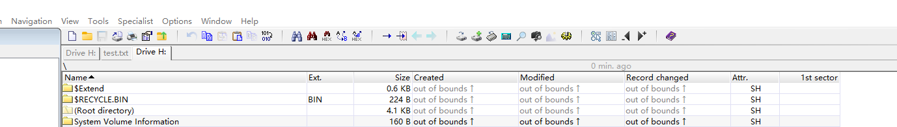

# 实验一 磁盘结构与文件系统

|   课程名称   |  软件安全  |   实验日期   | 2022.10.1 |
| :----------: | :------------------: | :----------: | :-------: |
| **实验名称** | 磁盘结构与文件系统 | **实验周次** | 第一次 |
|   **姓名**   |       **学号**       |   **专业**   | **班级**  |
|    李心杨    |    2020302181022     |   信息安全   |     1     |
|    林锟扬    |    2020302181032     |   信息安全   |     1     |
|  上官景威    |    xxxxxxxx     |   信息安全   |     x     |

## 实验目的及实验内容

### 实验目的

1. 加深对FAT32分区及文件系统格式的理解
2. 掌握借助 WinHex 等工具手工定位磁盘文件数据的技能
3. 通过开发一个磁盘文件数据提取工具，强化编程实践能力

### 实验内容

- 内容一：手工定位和提取 FAT32 分区中的文件数据
  
  在 FAT32 分区下创建一个不小于 10K 的 Word 文档，根据课上介绍的FAT32分区及文件系统知识，必要时自行上网查阅相关资料，借助WinHex或其它十六进制工具，以手工方式从磁盘中逐一找到该文件的各个存储扇区，复制其中的有效内容，并拼接组合成一个与原文档内容相同的完整文档。

- 内容二：编程实现内容一的全过程
  
  参考接口：输入某个文件的路径，输出如下信息：
  
  1. 该文件的短文件名目录项信息
  2. 该文件的簇链
  3. 根据上述的文件簇链，从磁盘上提取数据并拼接而得的新文件
  4. 文件A与文件B内容完全一致

## 内容一：人工解析 FAT32 文件系统

> 在本实验中，我们在两个不同的操作系统下进行了人工解析的实验。

### Windows 下的人工解析

新加 H 卷并在其中创建 test.txt 文件。


在 WinHex 中打开文档所在磁盘。



记录 DBR 中的重要字段。


计算根目录首簇起始扇区号，公式如下：


得到结果 8192。

跳转到根目录扇区。


记录根目录中重要字段。


得到 FAT1 的起始扇区号为 206。

跳转至 FAT1。


可知文件首簇号为 5，文件簇链为：


偏移为 8216。跳转至该文件：、


由上可知该文件大小为11770，选中文件且复制该内容至新文件。


对比可发现文件完全相同。


### Linux 下的人工解析

实验环境：
- Ubuntu 20.04.5 LTS (GNU/Linux 5.4.0-126-generic x86_64)  
- 实验工具：
  - mkfs.fat 4.1 (2017-01-24)
  - hexdump

Linux 下进行实验，是利用 Linux 下一切皆文件的特性，创建磁盘映像并格式化后，利用 loop 设备挂载写入，然后使用 hexdump 分析磁盘的二进制内容。

具体的操作如下：

- 利用 zero 设备或 bximage 创建磁盘映像。

```bash
bximage -func=create -fd=40M -q myDisk.img
dd if=/dev/zero of=myDisk.img bs=1M count=40
```

> 关于如何在 Linux 上创建一个拥有文件系统甚至分区的磁盘映像，我总结在了这篇博客里：[use-disk-image-for-fslab](https://qing-lky.github.io/2022/09/28/use-disk-image-for-fslab/)。此处我们只研究 FAT32 文件系统，因此不进行分区。

- 使用 `mkfs` 进行磁盘格式化。它要求磁盘至少有 65525 个簇。这也是前面选择 40Mb 作为磁盘大小的原因。

```bash
mkfs.fat -F32 myDisk.img
```

- 挂载磁盘并写入文件。

```bash
mount -o loop myDisk.img /mnt/myhd
```

- 使用 hexdump 导出信息，然后使用文本编辑器来阅读。

```bash
hexdump -C myDisk.img > dump.txt
```

- 解析过程：

  目标文件：/testDir1/test.doc

  阅读 BPB，计算关键信息：

  

  找到并分析 testDir1 目录项：

  

  分析 test.doc 目录项，找到簇链和文件内容：

  

### Linux 目录项的特殊性

  > 由于后续的项目我们将在 Linux 下实现。因此此处特开一节，介绍 Linux 下的 FAT32 与 Windows 下的区别。

  在实践中，我们注意到，Linux 对 FAT32 中文长文件名的解析规则与 Windows 下不同。

  Windows 下，中文在 LFN 中会被编码为 UTF-16，但在 Linux 下，它的编码方式较为简单。在下图中，我们编程输出了某个中文长文件名的 16 进制编码（默认使用的是 UTF-8 编码），并和磁盘二进制文件名中的 LFN 进行对比。

  

  不难发现，Linux 直接将 UTF-8 编码的文件名按字节拆开，并直接在高位补充 0 填充为两个字节。

  在后续的编程中，我们使用的也是这种解析方式。尽管我们实际上也实现了 UTF-16 的解码，但由于测试困难等原因，最终的成品项目中，我们的中文编码方式依然是 UTF-8，并没有对 UTF-16 的中文文件名提供支持。

  除此之外，我们还注意到了一些有趣的细节。在 Linux 下，除了 `.` 和 `..` 外，无论文件名有多短，系统都会为之分配至少一个 LFN。

  

  我们推测，这可能与短文件目录项文件名部分的空白填充方式有关。Linux 支持在文件名中使用空格，而短文件名的 11 个字节中，对多余字节的处理也是填充空格，这可能产生解析上的歧义。因此，出于准确和方便的考虑，Linux 为每个文件都分配了 LFN。

  当然，在后续的编程实现中，我们还是针对短目录项的末尾空格进行了排除处理，以兼容 Windows 下磁盘映像中的短目录项。

## 内容二：编程解析 FAT32 文件系统

### 实验环境

考虑到不同操作系统对于 FAT32 的解析和编码逻辑（尤其是长文件名编码）存在差异，此处列出经过测试的环境以供参考：

- VMware® Workstation 16 Pro
  - Ubuntu 20.04.5 LTS (GNU/Linux 5.4.0-126-generic x86_64)

### 项目说明

#### 项目简介

本项目针对 Linux 开发，主要功能为解析 FAT32 格式的磁盘文件中的数据。我们的 GitHub 仓库链接是：[https://www.github.com/Qing-LKY/FAT32-Reader](https://www.github.com/Qing-LKY/FAT32-Reader)。

已经实现的主要功能有：

- 文件系统功能
  - [x] 使用 `ls` 和 `cd` 浏览文件系统
  - [x] 提取文件数据
  - [x] 正确解析已经删除的目录
  - [ ] 恢复已经删除的文件
  - [ ] 向 FAT32 中写入文件
- 长目录项解析
  - [x] 长目录项与对应短目录项的合并
  - [x] 支持显示长名称
  - [x] 解析使用 UTF-8 编码的长目录项
  - [ ] 解析使用 UTF-16 编码的长目录项
- 命令行界面
  - [x] 基本功能
  - [x] 错误提示
  - [x] 命令历史记录

#### 项目结构

项目的文件结构如下：

```bash
.
├── CMakeLists.txt        // 用于编译项目的 CMake 配置文件
├── doc                   // 文档，包含实验报告
├── include               // 项目头文件
│   ├── fat.h
│   ├── file.h
│   ├── interact.h
│   └── io.h
├── src                   // 项目源代码
│   ├── CMakeLists.txt
│   ├── fat.c
│   ├── interact.c
│   ├── io.c
│   └── main.c
└── tests                 // 测试文件
```

本项目主要分为3层，自底向上表示不同的功能：

- `io.c`: 封装操作系统提供的 io 操作。将磁盘文件整个读入到内存中，再从内存中获取 DBR、FAT 的信息，填入到对应数据结构中。可以向上层函数提供寻找后继簇、单个簇读取的功能。上层应用不需要再读取文件分配表，也不需要计算簇对应的字节偏移，可以直接以簇为基本单位，实现解析功能。

- `fat.c`: 解析目录项信息。解析一个目录下的所有目录项，将其中的长目录项与相关联的短目录项合并起来。如果目录项表示的是目录，则解析此目录下所有子目录及文件的目录项；如果表示的是文件，则完整读入目录项对应的文件，

- `interact.c`: 命令行交互界面。接受用户指令，并完成相应的请求。

下图描述了各个主要函数之间的调用关系：


图中函数的原型及功能：

```c
int interact_load_image();    // 引导用户载入磁盘映像 成功返回 0

int interact_change_path();   // 引导用户移动地址

int show_files();             // 显示这个文件夹的信息

int interact_dump_file();     // 引导用户导出文件

int interact_normal();        // 引导用户输入指令

// 解析目录，返回由该目录下所有目录项组成的数组
// 如果出错，返回 NULL
// e 为待解析目录项，len 用于返回目录项数组的大小
fat_entry_t *fat_parse_dir(fat_entry_t *e, int *len);

// 把 e 对应的文件写入 target_fd 中
int fat_to_file(fat_entry_t *e, int target_fd);

// 将磁盘镜像文件读入内存
int load_disk_img();

// 从读入的磁盘镜像中解析 DBR 信息
int load_DBR_info();

// 将 cluster 中的数据读入到 buf 中，
// 需要保证 buf 的可用空间大小大于簇大小
// 出错返回负数
int read_clus(u32 cluster, u8 *buf);

// 接收簇号，找到该簇号指向的下一个簇
// 如果出错，返回CLUS_EMPTY, CLUS_RESERVED 或 CLUS_BAD
u32 next_clus(u32 clus);
```

项目中用到的主要数据结构如下图所示：


`fat_superblock_t` 用于存储磁盘镜像文件上 FAT32 文件系统的基本信息，包括 DBR 中的每扇区字节数（size_per_cluster）、每簇扇区数(sector_per_cluster)、保留扇区数（reserved_sectors_num）等等。此类型主要用于 `io.c` 中，`io.c` 会为每个磁盘镜像文件创建一个超级块变量，从而实现对文件系统的索引，此变量对 `fat.c` 和 `interact.c` 不可见。

`fat_entry_t` 解析后的存储长/短目录项信息。对于长目录项来说，ordinal、name、n_len 和 attr 这四个成员是有效的，分别代表长目录项首位的序数、指向名称的指针、名称长度和属性值（0x1F，用于区分长/短目录项）；而对于短目录项来说，i_first、name、n_len、attr 和 size 是有效的，除了名称及长度外，其余三项分别代表：首簇号、[属性值](https://en.wikipedia.org/wiki/Design_of_the_FAT_file_system#DIR_OFS_0Bh)和文件大小（如果表示目录，则大小为0）。

#### 使用说明

##### 编译安装

依赖 [libreadline](https://tiswww.case.edu/php/chet/readline/rltop.html)。

Ubuntu 下，可以使用下面的指令安装：

```bash
sudo apt install libreadline-dev
```

编译方式：

```bash
mkdir -p build && cd build
cmake -DCMAKE_BUILD_TYPE=Release ../
make && make install
```

编译后在 `build/bin/` 下得到可执行的 `fat32-reader`。

在 cmake 时添加选项 `-DSHOW_CLUSTER=1`，就可以在 dump 时输出文件所包含的簇链

##### 使用说明

运行后，会看到提示前缀 `[ImagePath:FilePath]$ `。ImagePath 是现在所加载的磁盘文件名，FilePath 是当前所处的文件夹名。

你可以通过输入来与程序交互：

- 输入 `load`，会进入加载磁盘映像的引导
- 输入 `disk`，可以显示 FAT32 文件系统的 DBR 信息
- 输入 `exit`，可以退出程序
- 输入 `cwd`，可以显示完整的当前位置
- 输入 `ls`，可以显示当前位置下的文件和文件夹
- 输入 `dump`，进入导出文件的引导，可以导出一个当前位置下的文件
- 输入 `cd`，进入切换目录的引导

#### 运行效果

下面给出的截图，展示了运行的效果：

使用 `load` 加载磁盘。除截图上使用的路径外，也可以使用相对路径（相对的是你运行 fat32-reader 时所在的路径，而不是 fat32-reader 所在的路径）。但是不能使用 `~` 来代指 home，因为它是 shell 提供的辅助符号。

可以使用 `ls` 查看当前目录下的文件情况，使用 `cd` 来切换目录。除了截图上只切换一个目录外，也可以一次切换多个目录。如：`a/b/c`。非根目录下允许使用 `..`。

输入的目录第一个字符如果是 `/`，则会先切会根目录。


使用 `cwd` 可以看到当前的完整位置。


使用 `disk` 可以查看载入的 FAT32 文件系统的 DBR 信息。


使用 `dump` 可以导出文件。


我们导出的文件内容，与真实文件的内容是完全一致的。


在撰写实验报告时，我们注意到任务要求中有“输出簇链”这一要求。注意到这个要求后，我们在文件导出的时候加上了对簇号的输出，来完成这个任务。并有了下面的截图：


出于美观考虑，输出簇链的代码在平时是关闭的。只有在定义了 `SHOW_CLUSTER` 这个宏时才会启用。在 fat.h 中添加一行才会启用这一功能：

```c
#define SHOW_CLUSTER
```

### 代码解析

#### DBR 信息加载

主要定义在 io.c 和 io.h 中。关键代码如下：

```c
int load_DBR_info() {
    static int err;
    fat_superblock_t *sb = &fat_superblock;
    err = read_offset(img_fd, 0, 0x200, img_buf);
    if (err) return err;
    sb->size_per_sector = *(u16 *)(img_buf + 0x0B);
    sb->sectors_per_cluster = *(u8 *)(img_buf + 0x0D);
    sb->reserved_sectors_num = *(u16 *)(img_buf + 0x0E);
    sb->FATs_num = *(u8 *)(img_buf + 0x10);
    sb->sectors_num = *(u32 *)(img_buf + 0x20);
    sb->sectors_per_FAT = *(u32 *)(img_buf + 0x24);
    sb->root_clus = *(u32 *)(img_buf + 0x2C);
    fat_offset = sb->reserved_sectors_num * sb->size_per_sector;
    data_offset =
        fat_offset + (sb->FATs_num * sb->sectors_per_FAT -
                      2 * sb->sectors_per_cluster) * /* 簇编号从2开始 */
                         sb->size_per_sector;
    return 0;
}
```

在代码中，我们先调用 `read_offset` 函数。它被定义在 `file.h` 中，用于从文件中读取某个偏移处的内容到缓冲区中。它的定义如下：

```c
static inline int read_offset(int fd, off_t addr, size_t siz, u8 *buf) {
    if(lseek(fd, addr, SEEK_SET) == -1) return errno;
    if(read(fd, buf, siz) == -1) return errno;
    return 0;
}
```

DBR 在我们载入的 FAT32 分区的起始部分，BPB 的大小为 512 个字节。因此我们把磁盘偏移 0 处的 512 个字节读入缓冲区中。接下来，依据下表，依次解析 BPB 中包含的信息，存储到一个结构体中。


这个结构体被定义在 fat.h 中。

```c
typedef struct fat_superblock_t {
    u16 size_per_sector;
    u8 sectors_per_cluster;
    u16 reserved_sectors_num;
    u8 FATs_num;
    u32 sectors_num;
    u32 sectors_per_FAT;
    u32 root_clus;
} fat_superblock_t;

extern fat_superblock_t fat_superblock;
```

除此之外，函数还顺便计算出了数据部分和 FAT 表的偏移量，保存在环境变量中方便后续的解析调用。

#### 簇链获取

获取簇链的方式非常简单，读取相应偏移处的值即可得到下一簇的位置，簇号不在合法范围内时，簇链就获取完成了。

> “不在合法范围内” 这个描述可能有些粗暴，但对于编程而言足够了。更准确的说，是 `(cluster & 0x0FFFFFFF) == 0x0FFFFFFF`。

下面的函数定义在 io.h 中，传入簇号，输出下一个簇的簇号。

```c
u32 next_clus(u32 cluster) {
    u32 nxt = 0xFFFFFFFFU; /* Next cluster */
    read_offset(img_fd, fat_offset + cluster * 4, 4, (u8 *)&nxt);
    return nxt;
}
```

获取簇链的过程在我们解析目录和文件的时候一直有出现，就是一个简单的 while 循环。

```c
while(clus < mx_clus) {
  do_something...
  clus = next_clus(clus);
}
```

#### 目录项解析

目录项解析是项目中比较复杂的部分之一，因为其涉及到短目录项、长目录项的解析、合并，且需要考虑编码、多簇和跨簇目录项等诸多复杂的情况。本项目中实现了目录项解析的函数：

```c
fat_entry_t *fat_parse_dir(fat_entry_t *e, int *len) {
  ...
  int clus = e->i_first;
  while (1) {
    for (int i = 0; i < entries_per_cluster; i++) {
      int ret = fat_parse_entry(&entries[i_entry], entry_buf);
      if (entries[i_entry].attr == ENTRY_ATTR_LFN) {
        // 长目录项
        ...
      } else {
        // 短目录项
        ...
      }
      ++i_entry;
    }
    entry_buf += ENTRY_SIZE;
    clus = next_clus(clus);
    ...
  }
}
```

由于此函数较长，故只摘了取骨架部分。向此函数提供待解析目录的目录项，可以得到一个包含此目录下所有目录项的数组。数组中仅含有短目录项，且如果短目录项有对应的长目录项，则将短目录项的名称直接替换为长目录项的名称，并删除长目录项。

函数主要由两层循环构成，外部循环顺着簇链获取每次获取一个簇，以解决目录项可能跨多个簇的问题；内部循环解析每个簇中的所有目录项，并且处理目录项合并的问题。解析目录项的具体工作由另一个函数 `fat_parse_entry()` 完成。这个函数定义如下：

```c
int fat_parse_entry(fat_entry_t *entry, u8 *buf);
```

其具体作用是从大小为32字节的buf中，提取目录项信息，并保存到entry中。显然，函数要分短目录项和长目录项分别进行处理。处理的过程没有什么困难，基本就是到指定偏移处读取信息，并保存在结构体中。这里值得一提的是对于长目录项文件名的处理。如上文所述，Linux 下，FAT32 文件系统中长文件名采用 UTF-8 编码，两个字节的数据中实际上只有高字节有效，低字节始终为0。所以这里读取到 u16 类型中，然后强制转换成 u8 类型。

除了解析目录项外，还需要将长文件目录项合并到对应的短文件目录项中。这个功能主要由以下函数完成：

```c
int fat_merge_lfn(fat_entry_t *head, fat_entry_t *tail);
```

在内层循环中记录长文件目录项的开始和结束位置，当遇到最后一个长文件目录项时，调用上述函数。这个函数把 head -> tail 中目录项的名字都按顺序拼接在一起。函数的实现也很直接，使用 `strncat()` 拼接字符串，并释放掉多余的字符串。

#### 文件导出

文件导出实现在 `fat.c` 中。重要的函数如下：

```c
int fat_to_file(fat_entry_t *e, int target_fd) {
    if((e->attr & ENTRY_ATTR_ARC) == 0) return -1;
    fat_superblock_t *sb = &fat_superblock;
    int rest = e->size, clus = e->i_first;
    int mx_clus = (int)sb->size_per_sector / 4 * (int)sb->sectors_per_FAT;
    int siz_clus = (int)sb->sectors_per_cluster * (int)sb->size_per_sector;
    u8 *buf = (u8 *)malloc(siz_clus);
    int err = 0;
    while(clus < mx_clus) {
        int err = read_clus(clus, buf);
        if(err != 0) break;
        int sz = rest > siz_clus ? siz_clus : rest;
        write(target_fd, buf, sz);
        rest -= sz;
        clus = next_clus(clus);
    }
    free(buf);
    return err;
}
```

它会查找该目录项的簇链，将簇号对应的数据簇读入 buf，写入文件中。

我们根据 FAT 表的大小计算了 `mx_clus` 来表示簇的最大簇号，用于簇链结束的判断。这一判断也可以改成前面提到的 `(cluster & 0x0FFFFFFF) == 0x0FFFFFFF`。

我们还计算了每个簇的大小 `siz_clus`，并结合目录项中记录的文件大小，来保证不会往文件中写入多余内容。

#### 用户交互

用户交互部分的代码在 interact.c 中。主要用于引导、读取用户输入。

在这一部分中，我们引入了 readline 库来引导用户输入。这使得我们的交互界面支持光标的左右移动和历史记录。

此外，这部分中也有一些比较关键的代码。

##### 对 cd 的支持

```c
int parse_filepath(char *s, int n) {
    int l = 1, r = 1;
    if(s[0] != '/') l = r = 0;
    else now = root, reset_cwd();
    while(l < n) {
        /* 解析出当前目录下的目录项 */
        int len;
        fat_entry_t *arr = fat_parse_dir(&now, &len);
        /* s[l...r-1] 是目标目录的名字 */
        while(r < n && s[r] != '/') r++;
        /* 尝试寻找 */
        u8 attr = ENTRY_ATTR_DIR;
        s[r] = 0;
        int flag = 0;
        for(int i = 0; i < len; i++) {
            if((arr[i].attr & attr) && strcmp(s + l, arr[i].name) == 0) {
                flag = 1;
                free(now.name);
                entry_copy(&now, arr + i); /* 找到后，将 now 移动过去 */
                if(now.i_first == 0) now.i_first = sb->root_clus;
                next_cwd(now.name); /* 更新 cwd */
                break;
            }
        }
        /* free array */
        free_entry_array(arr, len);
        if(!flag) {
            printf("Dir %s not found!\n", s + l);
            return -1;
        }
        l = r + 1, r = l;
    }
    return 0;
}
```

在 interact.c 中，为了支持相对路径，我们定义了一个 `fat_entry_t` 结构体 `now`，来存储当前所在路径的目录项的相关信息。它同时，也是个指向当前所在位置的“指针”。

在上面的代码中，将字符串中的 `/` 作为分界，将输入解析成一级一级的目录，同时移动当前位置的“指针”。通过前面介绍的 `fat_parse_dir` 获取当前 目录下的所有目录项，然后一一进行名字比对，找到目标后修改指针，并调用 `next_cwd` 来更新 cwd 的显示字符串。

##### 对 cwd 的支持

cwd 的显示和维护主要由下面的代码完成：

```c
char *cwd[BUF_SIZE]; int ccwd;

int reset_cwd() {
    for(int i = 0; i < ccwd; i++) free(cwd[i]);
    ccwd = 1;
    cwd[0] = (char *)malloc(2);
    cwd[0][0] = '/', cwd[0][1] = 0;
    return 0;
}

int roll_back_cwd() {
    ccwd--;
    free(cwd[ccwd]);
    return 0;
}

int next_cwd(char *name) {
    int n = strlen(name);
    if(n == 2 && name[0] == '.' && name[1] == '.') {
        roll_back_cwd();
    } else if(n == 1 && name[0] == '.') {
        /* do nothing */
    } else {
        cwd[ccwd] = (char *)malloc(n + 1);
        memcpy(cwd[ccwd], name, n + 1);
        ccwd++;
    }
    return 0;
}

int print_cwd() {
    print_string(img_path);
    printf(":");
    for(int i = 1; i < ccwd; i++) {
        putchar('/');
        print_string(cwd[i]);
    }
    if(ccwd == 1) putchar('/');
    return 0;
}
```

`cwd` 是一个字符串数组，按照级别依次记录当前位置。其中，`reset_cwd` 用于重置当前位置为 root，`next_cwd` 用于分析 cwd 应该产生的变化。与 `roll_back_cwd` 配合，实现了对 `.` 和 `..` 的正确解析。

##### 对 ls 和 dump 的支持

对这两个指令的支持是最简单的，`ls` 通过调用前面定义的 `fat_parse_dir` 就可以轻松的实现。而 `dump` 则引导用户输入后调用 `fat_to_file` 即可。

```c
int show_files() {
    if((now.attr & ENTRY_ATTR_DIR) == 0) {
        puts("Not a directory! Maybe you are going to dump it?");
        return -1;
    }
    int len;
    fat_entry_t *arr = fat_parse_dir(&now, &len);
    for(int i = 0; i < len; i++) {
        if(arr[i].attr & ENTRY_ATTR_DIR) printf("Dir: ");
        else printf("File: ");
        print_string(arr[i].name);
        puts("");
    }
    return 0;
}
```

#### 内存管理

代码中，我们使用了大量的动态空间用于存放目录项、字符串等。因此，我们编程时格外注意内存的释放。

这一点，主要体现在交互时 cwd 和 now 的维护、fat_entry 数组使用和释放、解析目录项时 LFN 的存储和合并等。

不过，在我们使用 `valgrind --tools=memcheck` 进行测试时，还是发现了不少的内存泄露情况。

由于时间有限，我们无法在报告提交前将所有的内存泄露完全修复。欢迎关注我们 GitHub 仓库的后续更新。

## 小组分工与贡献说明

李心杨：负责了目录项的解析（目录项信息提取、LFN 合并、目录分析等）、交互的优化和 cmake 的配置。

林锟扬：负责了磁盘加载、文件内容导出和交互部分的主体（对相对路径的支持、cwd 的维护、给用户的提示）。

上官景威：负责了 Windows 下的内容一和部分实验报告。
