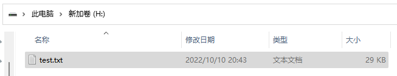
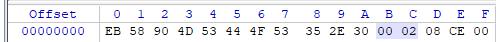
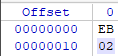
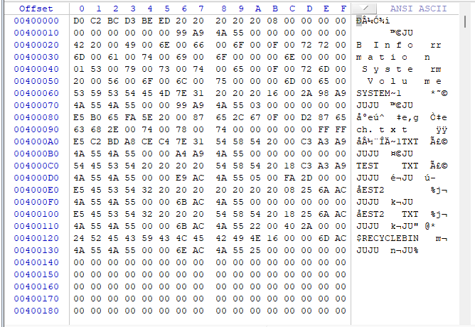

# 实验一 磁盘结构与文件系统

|   课程名称   |  软件安全  |   实验日期   | 2022.10.1 |
| :----------: | :------------------: | :----------: | :-------: |
| **实验名称** | 磁盘结构与文件系统 | **实验周次** | 第一次 |
|   **姓名**   |       **学号**       |   **专业**   | **班级**  |
|    李心杨    |     202030281022     |   信息安全   |     1     |
|    林锟扬    |    2020302181032     |   信息安全   |     1     |
|  上官景威    |    xxxxxxxx     |   信息安全   |     x     |

## 实验目的及实验内容

### 实验目的

1. 加深对FAT32分区及文件系统格式的理解
2. 掌握借助 WinHex 等工具手工定位磁盘文件数据的技能
3. 通过开发一个磁盘文件数据提取工具，强化编程实践能力

### 实验内容

- 内容一：手工定位和提取 FAT32 分区中的文件数据
  
  在 FAT32 分区下创建一个不小于 10K 的 Word 文档，根据课上介绍的FAT32分区及文件系统知识，必要时自行上网查阅相关资料，借助WinHex或其它十六进制工具，以手工方式从磁盘中逐一找到该文件的各个存储扇区，复制其中的有效内容，并拼接组合成一个与原文档内容相同的完整文档。

- 内容二：编程实现内容一的全过程
  
  参考接口：输入某个文件的路径，输出如下信息：
  
  1. 该文件的短文件名目录项信息
  2. 该文件的簇链
  3. 根据上述的文件簇链，从磁盘上提取数据并拼接而得的新文件
  4. 文件A与文件B内容完全一致

## 内容一：人工解析 FAT32 文件系统

> 在本实验中，我们在两个不同的操作系统下进行了人工解析的实验。

### Windows 下的人工解析

新加 H 卷并在其中创建 test.txt 文件。

在 WinHex 中打开文档所在磁盘。

记录 DBR 中的重要字段。

计算根目录首簇起始扇区号，公式如下：

得到结果 8192。

跳转到根目录扇区。

### Linux 下的人工解析

## 内容二：编程解析 FAT32 文件系统

### 实验环境

考虑到不同操作系统对于 FAT32 的解析和编码逻辑（尤其是长文件名编码）存在差异，此处列出实验环境以供参考：

- VMware® Workstation 16 Pro
  - Ubuntu 20.04.5 LTS (GNU/Linux 5.4.0-126-generic x86_64)
- 

### 项目说明

- 项目简介

- 项目结构

- 使用说明

- 运行效果

### 代码解析

- 关键量计算

- 目录项解析

- 簇链追踪

- 文件导出

- 用户交互

### 注意事项

## 小组分工与贡献说明

